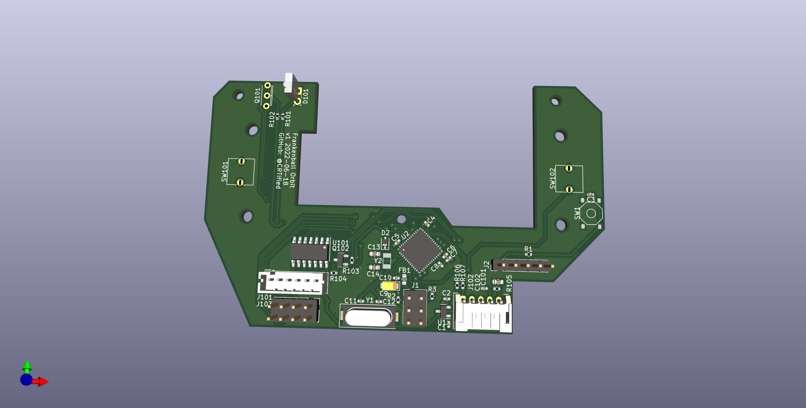

# Frankenball Orbit

This project is a drop-in replacement PCB for the Kensington Orbit.
Besides the basic functionality, it exposes 5 additional GPIO pins and is 
powered by QMK.

The sensor used in the Kensington Orbit is an ADNS-5050.

This project was mostly intended to be a precursor for a different PCB drop-in.

## Rendered PCB

